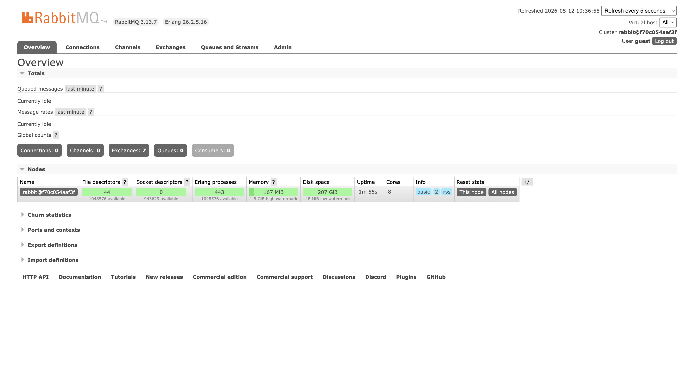
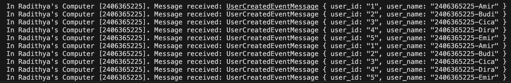
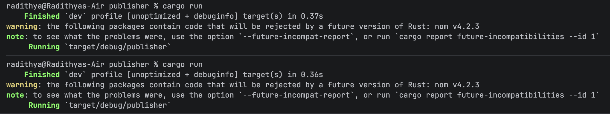
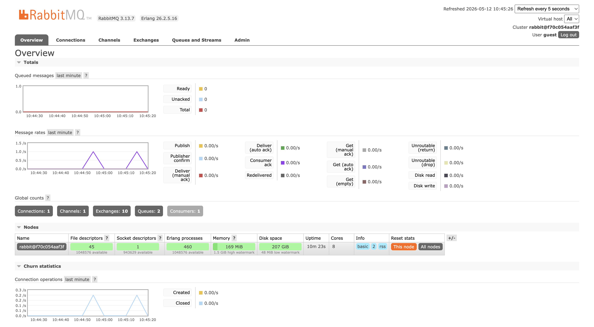

1. The program sends 5 messages in total. From the main function in the code, it calls the publish_event function five times, sending five different names.
2. It means both the Publisher and the Subscriber are connecting to the same address. For communication to work, the program sending the mail and the program receiving the mail must use the same address so they can find each other.
---

What Happened: When I run the publisher program, it creates and sends 5 specific events to the RabbitMQ message broker. Because the subscriber is already connected and listening, it immediately picks up these events from the broker and processes them, which is why we see the messages appearing in the subscriber's terminal window.
---

What Happened: When the publisher sends messages, a 'spike' appears on the RabbitMQ message rate chart. This spike visually represents the data being sent by the publisher and handled by the broker. It shows that the message broker is successfully receiving and delivering the events.